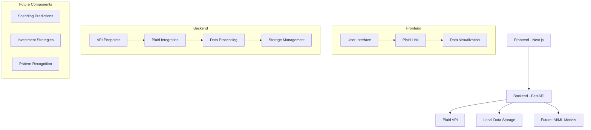
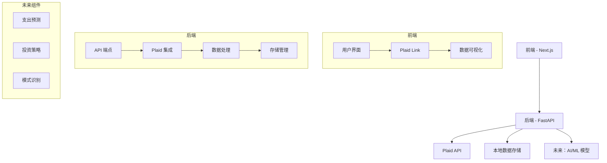

# Personal Finance Application
# 个人财务应用

[English](#english) | [中文](#chinese)

<a name="english"></a>
## English

A modern personal finance application that helps users track their finances, analyze spending patterns, and make informed financial decisions. Built with Python FastAPI backend and Next.js frontend.

## Features

- Connect to financial institutions using Plaid API
- View account balances and transactions
- Analyze spending patterns by category and institution
- Historical data analysis with customizable date ranges
- Automatic data refresh and updates
- (Future) AI-powered spending predictions and investment strategies

## Tech Stack

- Backend: Python FastAPI
- Frontend: Next.js with TypeScript
- UI: Chakra UI
- State Management: React Query
- API Integration: Plaid API
- Data Storage: Local JSON (Future: Blockchain)
- (Future) AI/ML: Deep Learning for predictions

## System Design



## Prerequisites

- Python 3.8+
- Node.js 16+
- Plaid API credentials

## Setup

### Backend Setup

1. Install dependencies:
```bash
cd backend
pip install -r requirements.txt
```

2. Create a `.env` file in the root directory:
```bash
cp .env.example .env
```

3. Update the `.env` file with your Plaid API credentials:
```env
PLAID_CLIENT_ID=your_client_id
PLAID_SECRET=your_secret
PLAID_ENV=sandbox  # or production
```

4. Run the backend server:
```bash
# Windows
run_backend.bat

# Or manually
cd backend
python main.py
```

### Frontend Setup

1. Install dependencies and run the development server:
```bash
# Windows
run_frontend.bat

# Or manually
cd frontend
npm install
npm run dev
```

## Plaid Integration

### Sandbox Testing

1. Use Plaid's sandbox environment for testing:
   - Set `PLAID_ENV=sandbox` in your `.env` file
   - Use test credentials:
     - Username: `user_good`
     - Password: `pass_good`
   - Test institutions:
     - Chase
     - Wells Fargo
     - Bank of America

2. Example API Response:
```json
{
  "accounts": [
    {
      "account_id": "1234567890",
      "name": "Checking",
      "type": "depository",
      "balance": 1000.00,
      "institution_name": "Chase"
    }
  ],
  "transactions": [
    {
      "transaction_id": "abc123",
      "amount": 50.00,
      "date": "2024-03-15",
      "name": "Grocery Store",
      "category": ["Food and Drink", "Groceries"]
    }
  ]
}
```

### Production Setup

1. Switch to production environment:
   - Set `PLAID_ENV=production` in your `.env` file
   - Use real Plaid API credentials
   - Connect to actual financial institutions

2. Security Considerations:
   - Store access tokens securely
   - Implement proper error handling
   - Follow Plaid's security best practices

## Data Flow

1. User connects bank account:
   - Frontend initializes Plaid Link
   - User selects institution and authenticates
   - Plaid returns public token

2. Backend processes connection:
   - Exchanges public token for access token
   - Fetches account information
   - Retrieves transaction history
   - Stores data locally

3. Data updates:
   - Automatic refresh after connection
   - Manual refresh available
   - Historical data access

## Future Enhancements

### AI/ML Integration

1. Spending Predictions:
   - Deep learning models for expense forecasting
   - Category-based pattern recognition
   - Seasonal trend analysis

2. Investment Strategies:
   - Portfolio optimization
   - Risk assessment
   - Market trend analysis

3. Smart Recommendations:
   - Budget optimization
   - Savings opportunities
   - Investment opportunities

### Technical Improvements

1. Data Storage:
   - Migration to blockchain for enhanced security
   - Distributed ledger for transaction history
   - Smart contracts for automated rules

2. API Enhancements:
   - Real-time data streaming
   - Webhook integration
   - Advanced analytics endpoints

## Development

- Backend API runs on: http://127.0.0.1:8000
- Frontend development server runs on: http://localhost:3000
- API documentation available at: http://127.0.0.1:8000/docs

## Project Structure

```
.
├── backend/
│   ├── main.py              # FastAPI application
│   ├── data_storage.py      # Data management
│   ├── models/             # Future: ML models
│   └── requirements.txt
├── frontend/
│   ├── pages/
│   │   ├── index.tsx       # Main dashboard
│   │   └── _app.tsx        # App configuration
│   ├── components/         # Reusable components
│   └── package.json
├── .env.example
├── run_backend.bat
├── run_frontend.bat
└── README.md
```

## Contributing

1. Fork the repository
2. Create your feature branch (`git checkout -b feature/amazing-feature`)
3. Commit your changes (`git commit -m 'Add some amazing feature'`)
4. Push to the branch (`git push origin feature/amazing-feature`)
5. Open a Pull Request

## License

This project is licensed under the MIT License - see the LICENSE file for details.

## Acknowledgments

- [Plaid API](https://plaid.com/)
- [FastAPI](https://fastapi.tiangolo.com/)
- [Next.js](https://nextjs.org/)
- [Chakra UI](https://chakra-ui.com/)
- [TensorFlow](https://www.tensorflow.org/) (Future)
- [Ethereum](https://ethereum.org/) (Future)

### 关键要点  
- 研究表明，使用 Plaid API 可以获取个人金融机构的存款或投资信息，并查询已开通的账户。  
- 证据倾向于建议通过 Plaid Link 让用户安全连接其金融机构，获取访问令牌并本地存储数据，以保护隐私。  
- 由于应用将开源并在本地运行，每个用户可能需要配置自己的 Plaid API 密钥，或使用开发者的密钥，但需注意使用限制和成本。  
- 后期考虑使用区块链存储数据，但目前建议先用 JSON 文件本地存储。  

---

### 设计个人财务应用的指南  

#### 概述  
您计划设计一个个人财务应用，使用 Plaid API 获取自己的金融机构存款或投资信息，并查询已开通的账户。由于您打算将代码开源到 GitHub，让大家可以在本地运行以避免数据泄露，并希望提供一个通用接口让用户输入自己的金融机构查询内容，同时保护隐私，所有账本信息将以 JSON 格式本地存储，未来可能考虑使用区块链存储。以下是详细设计指南，涵盖所有相关步骤和考虑因素。  

#### Plaid API 集成与数据获取  
Plaid 是一个金融数据聚合服务，允许通过 API 连接各种金融机构，获取账户信息、交易记录和投资数据。研究显示，Plaid 支持的机构覆盖美国、加拿大、英国和欧洲等地区，适合获取存款和投资信息 ([Plaid 全球覆盖](https://plaid.com/global/))。  

- **账户查询与数据类型**：  
  - 要查询已开通的账户，可以使用 Plaid 的 `/accounts/get` 端点，获取与 Item 关联的所有账户信息。  
  - 获取存款信息（如账户余额和交易记录），可以使用 Transactions 或 Balances 产品。  
  - 获取投资信息（如股票持仓和交易），可以使用 Investments 产品。  
  - 具体数据类型见下表：  

  | 数据类型       | 描述                              | Plaid 产品示例         |  
  |----------------|-----------------------------------|-----------------------|  
  | 账户列表       | 查询已开通的账户信息              | Accounts              |  
  | 账户余额       | 获取实时余额信息                  | Balances              |  
  | 交易记录       | 获取消费和收入历史（按日期、类别）| Transactions          |  
  | 投资持仓       | 获取股票、基金等投资资产信息      | Investments           |  

- **Plaid Link 集成**：  
  Plaid Link 是一个客户端组件，帮助用户安全连接其金融机构。应用初始化 Link，用户通过安全窗口选择金融机构并登录，成功后返回 public token，应用可通过 API 密钥将其兑换为 access token，用于后续数据请求 ([Plaid Link 文档](https://plaid.com/docs/link/))。  
  - 流程：用户运行应用 -> 启动 Plaid Link -> 选择金融机构并登录 -> 获取 public token -> 兑换为 access token -> 使用 access token 获取数据。  
  - 建议：为保护隐私，access token 应加密存储在用户本地机器上。  

#### 隐私与安全考虑  
- **本地运行与数据泄露避免**：由于应用在本地运行，每个用户的财务数据仅存储在其自己的机器上，减少数据泄露风险。  
- **API 密钥管理**：Plaid API 密钥由开发者账户提供，应用需要使用该密钥与 Plaid API 交互。由于应用开源，建议通过环境变量或配置文件（不提交到 GitHub）管理 API 密钥，避免暴露。  
  - 选项 1：每个用户获取自己的 Plaid API 密钥，适合生产环境，但需用户注册 Plaid 开发者账户，可能不实用。  
  - 选项 2：使用开发者的 API 密钥，所有用户共享，但需注意使用限制和成本，可能违反 Plaid 条款 ([Plaid 使用条款](https://plaid.com/legal/terms-of-use/))。  
  - 研究显示，Plaid 有使用限制（如免费 200 次 API 调用），超限需付费 ([Plaid 定价](https://plaid.com/pricing/))。  

- **数据存储**：您计划用 JSON 格式本地存储账本信息，这是合理的初始选择。未来考虑区块链存储需注意加密和隐私问题，确保只有用户能访问其数据。  

#### 通用接口设计  
- 应用应提供接口，让用户输入其金融机构查询内容，并通过 Plaid Link 连接。用户需提供 Plaid 账户 token（access token），但为保护隐私，建议应用自动管理 token，存储在本地。  
- 考虑到 Plaid 的地区覆盖（如对中国市场有限），用户可能需要确认其金融机构是否在 Plaid 支持范围内 ([Plaid 机构覆盖](https://plaid.com/institutions/))。  

#### 开源与本地运行  
- 将代码推送到 GitHub 是好的开源实践，但需确保敏感信息（如 API 密钥）不泄露。建议在代码中添加说明，让用户在运行前配置自己的 API 密钥或使用 Sandbox 环境测试。  
- Sandbox 环境免费，无限使用，适合开发和测试 ([Plaid Sandbox 概述](https://plaid.com/docs/sandbox/))，但生产环境需付费或按使用计费。  

#### 未来扩展：区块链存储  
- 区块链存储可能提高数据安全性，但实现复杂，需考虑加密方法和区块链网络选择（如以太坊或 Hyperledger）。目前建议先用 JSON 文件本地存储，未来再研究区块链方案。  

#### 结论与建议  
- 使用 Plaid API 获取存款和投资信息是可行的，通过 Plaid Link 让用户安全连接金融机构，数据本地存储保护隐私。  
- 建议应用支持 Sandbox 和 Production 环境，用户可选择；生产环境需用户配置自己的 API 密钥，或开发者承担使用成本并明确文档说明。  
- 确保代码开源时，敏感信息通过环境变量管理，文档说明使用限制和潜在成本。  

---

### 关键引文  
- [Plaid 全球覆盖](https://plaid.com/global/)  
- [Plaid Link 文档](https://plaid.com/docs/link/)  
- [Plaid 使用条款](https://plaid.com/legal/terms-of-use/)  
- [Plaid 定价](https://plaid.com/pricing/)  
- [Plaid Sandbox 概述](https://plaid.com/docs/sandbox/)  
- [Plaid 机构覆盖](https://plaid.com/institutions/)

<a name="chinese"></a>
## 中文

一个现代化的个人财务应用，帮助用户追踪财务状况、分析支出模式并做出明智的财务决策。使用 Python FastAPI 后端和 Next.js 前端构建。

## 功能特点

- 使用 Plaid API 连接金融机构
- 查看账户余额和交易记录
- 按类别和机构分析支出模式
- 可自定义日期范围的历史数据分析
- 自动数据刷新和更新
- （未来）AI 驱动的支出预测和投资策略

## 技术栈

- 后端：Python FastAPI
- 前端：Next.js + TypeScript
- UI：Chakra UI
- 状态管理：React Query
- API 集成：Plaid API
- 数据存储：本地 JSON（未来：区块链）
- （未来）AI/ML：深度学习预测

## 系统设计



## 环境要求

- Python 3.8+
- Node.js 16+
- Plaid API 凭证

## 安装设置

### 后端设置

1. 安装依赖：
```bash
cd backend
pip install -r requirements.txt
```

2. 创建 `.env` 文件：
```bash
cp .env.example .env
```

3. 更新 `.env` 文件中的 Plaid API 凭证：
```env
PLAID_CLIENT_ID=你的客户端ID
PLAID_SECRET=你的密钥
PLAID_ENV=sandbox  # 或 production
```

4. 运行后端服务器：
```bash
# Windows
run_backend.bat

# 或手动运行
cd backend
python main.py
```

### 前端设置

1. 安装依赖并运行开发服务器：
```bash
# Windows
run_frontend.bat

# 或手动运行
cd frontend
npm install
npm run dev
```

## Plaid 集成

### 沙箱测试

1. 使用 Plaid 的沙箱环境进行测试：
   - 在 `.env` 文件中设置 `PLAID_ENV=sandbox`
   - 使用测试凭证：
     - 用户名：`user_good`
     - 密码：`pass_good`
   - 测试机构：
     - Chase
     - Wells Fargo
     - Bank of America

2. API 响应示例：
```json
{
  "accounts": [
    {
      "account_id": "1234567890",
      "name": "支票账户",
      "type": "depository",
      "balance": 1000.00,
      "institution_name": "Chase"
    }
  ],
  "transactions": [
    {
      "transaction_id": "abc123",
      "amount": 50.00,
      "date": "2024-03-15",
      "name": "杂货店",
      "category": ["食品饮料", "杂货"]
    }
  ]
}
```

### 生产环境设置

1. 切换到生产环境：
   - 在 `.env` 文件中设置 `PLAID_ENV=production`
   - 使用真实的 Plaid API 凭证
   - 连接实际的金融机构

2. 安全考虑：
   - 安全存储访问令牌
   - 实现适当的错误处理
   - 遵循 Plaid 的安全最佳实践

## 数据流程

1. 用户连接银行账户：
   - 前端初始化 Plaid Link
   - 用户选择机构并认证
   - Plaid 返回公共令牌

2. 后端处理连接：
   - 将公共令牌交换为访问令牌
   - 获取账户信息
   - 检索交易历史
   - 本地存储数据

3. 数据更新：
   - 连接后自动刷新
   - 支持手动刷新
   - 历史数据访问

## 未来增强

### AI/ML 集成

1. 支出预测：
   - 使用深度学习模型进行支出预测
   - 基于类别的模式识别
   - 季节性趋势分析

2. 投资策略：
   - 投资组合优化
   - 风险评估
   - 市场趋势分析

3. 智能推荐：
   - 预算优化
   - 储蓄机会
   - 投资机会

### 技术改进

1. 数据存储：
   - 迁移到区块链以提高安全性
   - 交易历史的分布式账本
   - 自动化规则的智能合约

2. API 增强：
   - 实时数据流
   - Webhook 集成
   - 高级分析端点

## 开发

- 后端 API 运行在：http://127.0.0.1:8000
- 前端开发服务器运行在：http://localhost:3000
- API 文档可在：http://127.0.0.1:8000/docs 查看

## 项目结构

```
.
├── backend/
│   ├── main.py              # FastAPI 应用
│   ├── data_storage.py      # 数据管理
│   ├── models/             # 未来：ML 模型
│   └── requirements.txt
├── frontend/
│   ├── pages/
│   │   ├── index.tsx       # 主仪表板
│   │   └── _app.tsx        # 应用配置
│   ├── components/         # 可重用组件
│   └── package.json
├── .env.example
├── run_backend.bat
├── run_frontend.bat
└── README.md
```

## 贡献

1. Fork 本仓库
2. 创建特性分支 (`git checkout -b feature/amazing-feature`)
3. 提交更改 (`git commit -m '添加新特性'`)
4. 推送到分支 (`git push origin feature/amazing-feature`)
5. 创建 Pull Request

## 许可证

本项目采用 MIT 许可证 - 详见 LICENSE 文件

## 致谢

- [Plaid API](https://plaid.com/)
- [FastAPI](https://fastapi.tiangolo.com/)
- [Next.js](https://nextjs.org/)
- [Chakra UI](https://chakra-ui.com/)
- [TensorFlow](https://www.tensorflow.org/) (未来)
- [Ethereum](https://ethereum.org/) (未来)

### 关键要点  
- 研究表明，使用 Plaid API 可以获取个人金融机构的存款或投资信息，并查询已开通的账户。  
- 证据倾向于建议通过 Plaid Link 让用户安全连接其金融机构，获取访问令牌并本地存储数据，以保护隐私。  
- 由于应用将开源并在本地运行，每个用户可能需要配置自己的 Plaid API 密钥，或使用开发者的密钥，但需注意使用限制和成本。  
- 后期考虑使用区块链存储数据，但目前建议先用 JSON 文件本地存储。  

---

### 设计个人财务应用的指南  

#### 概述  
您计划设计一个个人财务应用，使用 Plaid API 获取自己的金融机构存款或投资信息，并查询已开通的账户。由于您打算将代码开源到 GitHub，让大家可以在本地运行以避免数据泄露，并希望提供一个通用接口让用户输入自己的金融机构查询内容，同时保护隐私，所有账本信息将以 JSON 格式本地存储，未来可能考虑使用区块链存储。以下是详细设计指南，涵盖所有相关步骤和考虑因素。  

#### Plaid API 集成与数据获取  
Plaid 是一个金融数据聚合服务，允许通过 API 连接各种金融机构，获取账户信息、交易记录和投资数据。研究显示，Plaid 支持的机构覆盖美国、加拿大、英国和欧洲等地区，适合获取存款和投资信息 ([Plaid 全球覆盖](https://plaid.com/global/))。  

- **账户查询与数据类型**：  
  - 要查询已开通的账户，可以使用 Plaid 的 `/accounts/get` 端点，获取与 Item 关联的所有账户信息。  
  - 获取存款信息（如账户余额和交易记录），可以使用 Transactions 或 Balances 产品。  
  - 获取投资信息（如股票持仓和交易），可以使用 Investments 产品。  
  - 具体数据类型见下表：  

  | 数据类型       | 描述                              | Plaid 产品示例         |  
  |----------------|-----------------------------------|-----------------------|  
  | 账户列表       | 查询已开通的账户信息              | Accounts              |  
  | 账户余额       | 获取实时余额信息                  | Balances              |  
  | 交易记录       | 获取消费和收入历史（按日期、类别）| Transactions          |  
  | 投资持仓       | 获取股票、基金等投资资产信息      | Investments           |  

- **Plaid Link 集成**：  
  Plaid Link 是一个客户端组件，帮助用户安全连接其金融机构。应用初始化 Link，用户通过安全窗口选择金融机构并登录，成功后返回 public token，应用可通过 API 密钥将其兑换为 access token，用于后续数据请求 ([Plaid Link 文档](https://plaid.com/docs/link/))。  
  - 流程：用户运行应用 -> 启动 Plaid Link -> 选择金融机构并登录 -> 获取 public token -> 兑换为 access token -> 使用 access token 获取数据。  
  - 建议：为保护隐私，access token 应加密存储在用户本地机器上。  

#### 隐私与安全考虑  
- **本地运行与数据泄露避免**：由于应用在本地运行，每个用户的财务数据仅存储在其自己的机器上，减少数据泄露风险。  
- **API 密钥管理**：Plaid API 密钥由开发者账户提供，应用需要使用该密钥与 Plaid API 交互。由于应用开源，建议通过环境变量或配置文件（不提交到 GitHub）管理 API 密钥，避免暴露。  
  - 选项 1：每个用户获取自己的 Plaid API 密钥，适合生产环境，但需用户注册 Plaid 开发者账户，可能不实用。  
  - 选项 2：使用开发者的 API 密钥，所有用户共享，但需注意使用限制和成本，可能违反 Plaid 条款 ([Plaid 使用条款](https://plaid.com/legal/terms-of-use/))。  
  - 研究显示，Plaid 有使用限制（如免费 200 次 API 调用），超限需付费 ([Plaid 定价](https://plaid.com/pricing/))。  

- **数据存储**：您计划用 JSON 格式本地存储账本信息，这是合理的初始选择。未来考虑区块链存储需注意加密和隐私问题，确保只有用户能访问其数据。  

#### 通用接口设计  
- 应用应提供接口，让用户输入其金融机构查询内容，并通过 Plaid Link 连接。用户需提供 Plaid 账户 token（access token），但为保护隐私，建议应用自动管理 token，存储在本地。  
- 考虑到 Plaid 的地区覆盖（如对中国市场有限），用户可能需要确认其金融机构是否在 Plaid 支持范围内 ([Plaid 机构覆盖](https://plaid.com/institutions/))。  

#### 开源与本地运行  
- 将代码推送到 GitHub 是好的开源实践，但需确保敏感信息（如 API 密钥）不泄露。建议在代码中添加说明，让用户在运行前配置自己的 API 密钥或使用 Sandbox 环境测试。  
- Sandbox 环境免费，无限使用，适合开发和测试 ([Plaid Sandbox 概述](https://plaid.com/docs/sandbox/))，但生产环境需付费或按使用计费。  

#### 未来扩展：区块链存储  
- 区块链存储可能提高数据安全性，但实现复杂，需考虑加密方法和区块链网络选择（如以太坊或 Hyperledger）。目前建议先用 JSON 文件本地存储，未来再研究区块链方案。  

#### 结论与建议  
- 使用 Plaid API 获取存款和投资信息是可行的，通过 Plaid Link 让用户安全连接金融机构，数据本地存储保护隐私。  
- 建议应用支持 Sandbox 和 Production 环境，用户可选择；生产环境需用户配置自己的 API 密钥，或开发者承担使用成本并明确文档说明。  
- 确保代码开源时，敏感信息通过环境变量管理，文档说明使用限制和潜在成本。  

---

### 关键引文  
- [Plaid 全球覆盖](https://plaid.com/global/)  
- [Plaid Link 文档](https://plaid.com/docs/link/)  
- [Plaid 使用条款](https://plaid.com/legal/terms-of-use/)  
- [Plaid 定价](https://plaid.com/pricing/)  
- [Plaid Sandbox 概述](https://plaid.com/docs/sandbox/)  
- [Plaid 机构覆盖](https://plaid.com/institutions/)