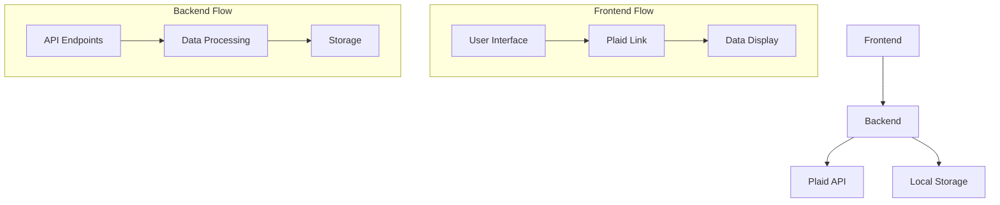

# Personal Finance Application

A modern personal finance application built with FastAPI and Next.js that helps users track finances, analyze spending patterns, and make informed financial decisions through Plaid API integration.

## Features

- **Bank Connection**: Securely connect to financial institutions via Plaid API
- **Account Management**: View balances and transactions across all accounts
- **Spending Analysis**: Track and categorize expenses
- **Historical Data**: Access up to 5 years of transaction history
- **Data Privacy**: All data stored locally for maximum security
- **Future Plans**: AI-powered predictions and investment strategies

## Tech Stack

### Backend
- Python FastAPI
- Plaid API Integration
- Local JSON Storage

### Frontend
- Next.js + TypeScript
- Chakra UI
- React Query

## Quick Start

### Prerequisites
- Python 3.8+
- Node.js 16+
- Plaid API credentials

### Backend Setup
```bash
cd backend
pip install -r requirements.txt

# Create and configure .env file
cp .env.example .env
# Add your Plaid credentials to .env
```

### Frontend Setup
```bash
cd frontend
npm install
npm run dev
```

## Plaid Integration Guide

### Sandbox Testing
1. Set environment:
```env
PLAID_ENV=sandbox
```

2. Use test credentials:
- Username: `user_good`
- Password: `pass_good`
- Test banks: Chase, Wells Fargo, Bank of America

### Production Setup
1. Update environment:
```env
PLAID_ENV=production
```

2. Security best practices:
- Secure token storage
- Error handling
- Rate limiting
- Data encryption

## Data Flow



## API Endpoints

- `POST /create_link_token`: Initialize Plaid connection
- `POST /exchange_token`: Exchange public token for access token
- `GET /accounts/{user_id}`: Retrieve account information
- `GET /transactions/{user_id}`: Get transaction history
- `GET /summary/{user_id}`: Get financial summary

## Development

### Local Development
```bash
# Backend (http://127.0.0.1:8000)
python main.py

# Frontend (http://localhost:3000)
npm run dev
```

### Project Structure
```
.
├── backend/
│   ├── main.py              # FastAPI app
│   ├── data_storage.py      # Data management
│   └── requirements.txt
├── frontend/
│   ├── pages/
│   │   └── index.tsx       # Main dashboard
│   └── package.json
└── .env.example
```

## Security

- Local data storage only
- No cloud dependencies
- Encrypted token storage
- Environment-based configuration

## Future Enhancements

### AI Integration
- Spending predictions
- Investment recommendations
- Pattern recognition

### Technical Improvements
- Blockchain storage option
- Real-time data streaming
- Advanced analytics

## Contributing

1. Fork the repository
2. Create feature branch
3. Commit changes
4. Push to branch
5. Create Pull Request

## License

MIT License - See LICENSE file

## Acknowledgments

- [Plaid](https://plaid.com/)
- [FastAPI](https://fastapi.tiangolo.com/)
- [Next.js](https://nextjs.org/)
- [Chakra UI](https://chakra-ui.com/)