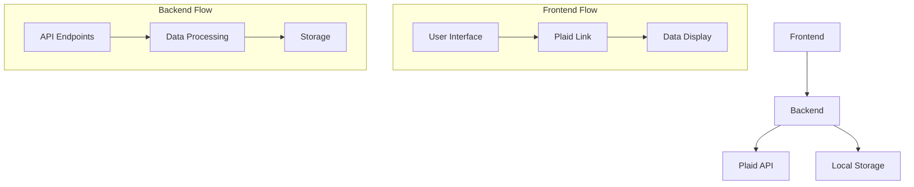

# Personal Finance Application

A modern personal finance application built with FastAPI and Next.js that helps users track finances, analyze spending patterns, and make informed financial decisions through Plaid API integration.

## Features

- **Bank Connection**: Securely connect to financial institutions via Plaid API
- **Account Management**: View balances and transactions across all accounts
- **Spending Analysis**: Track and categorize expenses
- **Historical Data**: Access up to 5 years of transaction history
- **Data Privacy**: All data stored locally for maximum security
- **Future Plans**: AI-powered predictions and investment strategies

## Demo

Watch the application demo on YouTube:
[](https://www.youtube.com/watch?v=ePrXtQ0dkfE)

## Tech Stack

### Backend
- Python FastAPI
- Plaid API Integration
- Local JSON Storage

### Frontend
- Next.js + TypeScript
- Chakra UI
- React Query

## Quick Start

### Prerequisites
- Python 3.8+
- Node.js 16+
- Plaid API credentials

### Getting Plaid Credentials

1. **Create a Plaid Account**
   - Visit [Plaid Dashboard](https://dashboard.plaid.com/signup)
   - Sign up for a developer account
   - Choose the appropriate plan (Sandbox is free for development)

2. **Get API Credentials**
   - Log in to your Plaid Dashboard
   - Navigate to Team Settings > API > All Keys
   - You'll find your:
     - Client ID
     - Sandbox Secret
     - Development Secret (if applicable)
     - Production Secret (if approved)

3. **Configure Environment**
   - Create a `.env` file in your project root
   - Add your credentials:
   ```env
   PLAID_CLIENT_ID=your_client_id
   PLAID_SECRET=your_secret_key
   PLAID_ENV=sandbox  # or development/production
   ```

4. **API Access Levels**
   - **Sandbox**: Free, unlimited testing with mock data
   - **Development**: Free, limited to 100 items
   - **Production**: Requires approval, usage-based pricing

5. **Production Access**
   - Complete the [Plaid Production Access Form](https://dashboard.plaid.com/team/keys)
   - Provide business details and use case
   - Wait for approval (typically 1-2 business days)

### Backend Setup
```bash
cd backend
pip install -r requirements.txt

# Create and configure .env file
cp .env.example .env
# Add your Plaid credentials to .env
```

### Frontend Setup
```bash
cd frontend
npm install
npm run dev
```

## Plaid Integration Guide

### Sandbox Testing
1. Set environment:
```env
PLAID_ENV=sandbox
```

2. Use test credentials:
- Username: `user_good`
- Password: `pass_good`
- Test banks: Chase, Wells Fargo, Bank of America

### Production Setup
1. Update environment:
```env
PLAID_ENV=production
```

2. Security best practices:
- Secure token storage
- Error handling
- Rate limiting
- Data encryption

## Plaid Python Use Cases

### 1. Account Connection
```python
# Initialize Plaid client
configuration = plaid.Configuration(
    host=plaid.Environment.Sandbox,
    api_key={
        'clientId': client_id,
        'secret': secret,
    }
)
api_client = plaid.ApiClient(configuration)
plaid_client = plaid_api.PlaidApi(api_client)

# Create link token for frontend
request = LinkTokenCreateRequest(
    user={"client_user_id": "user123"},
    client_name="Personal Finance App",
    products=[Products("transactions")],
    country_codes=[CountryCode("US")],
    language="en"
)
response = plaid_client.link_token_create(request)
link_token = response['link_token']
```

### 2. Fetching Account Data
```python
# Exchange public token for access token
exchange_request = ItemPublicTokenExchangeRequest(
    public_token="public-token"
)
exchange_response = plaid_client.item_public_token_exchange(exchange_request)
access_token = exchange_response['access_token']

# Get account information
accounts_request = AccountsGetRequest(access_token=access_token)
accounts_response = plaid_client.accounts_get(accounts_request)
accounts = accounts_response.to_dict()['accounts']
```

### 3. Transaction History
```python
# Get transactions for a date range
transactions_request = TransactionsGetRequest(
    access_token=access_token,
    start_date=date(2024, 1, 1),
    end_date=date(2024, 3, 15),
    options={"count": 500}
)
transactions_response = plaid_client.transactions_get(transactions_request)
transactions = transactions_response.to_dict()['transactions']
```

### 4. Institution Information
```python
# Get institution details
institution_response = plaid_client.institutions_get_by_id(
    request_id=str(uuid.uuid4()),
    institution_id="ins_123",
    country_codes=[CountryCode("US")]
)
institution_name = institution_response['institution']['name']
```

## Data Flow to Frontend

### 1. Backend Data Structure
```python
# Example summary data structure
summary = {
    "total_balance": 10000.00,
    "total_recent_transactions": 5000.00,
    "institutions": {
        "Chase": {
            "accounts": [...],
            "total_balance": 5000.00,
            "recent_transactions": [...]
        }
    },
    "account_types": {
        "checking": {
            "accounts": [...],
            "total_balance": 3000.00,
            "recent_transactions": [...]
        }
    },
    "categories": {
        "Food and Drink": {
            "transactions": [...],
            "total_amount": 500.00,
            "count": 10
        }
    },
    "last_updated": "2024-03-15 10:30:00"
}
```

### 2. Frontend Integration
```typescript
// Fetch summary data
const { data: summary } = useQuery(['summary', dateRange], async () => {
  const response = await axios.get(`http://localhost:8000/summary/${userId}`, {
    params: getDateRange()
  });
  return response.data;
});

// Display summary information
<Grid templateColumns="repeat(3, 1fr)" gap={6}>
  <GridItem>
    <Stat>
      <StatLabel>Total Balance</StatLabel>
      <StatNumber>${summary.total_balance.toFixed(2)}</StatNumber>
      <StatHelpText>Last updated: {new Date(summary.last_updated).toLocaleString()}</StatHelpText>
    </Stat>
  </GridItem>
  {/* More stats... */}
</Grid>
```

### 3. Real-time Updates
- Frontend uses React Query for automatic data refetching
- Backend provides fresh data on each request
- Date range selection triggers new data fetches
- Account connection automatically refreshes the UI

## Data Flow



## API Endpoints

- `POST /create_link_token`: Initialize Plaid connection
- `POST /exchange_token`: Exchange public token for access token
- `GET /accounts/{user_id}`: Retrieve account information
- `GET /transactions/{user_id}`: Get transaction history
- `GET /summary/{user_id}`: Get financial summary

## Development

### Local Development
```bash
# Backend (http://127.0.0.1:8000)
python main.py

# Frontend (http://localhost:3000)
npm run dev
```

### Project Structure
```
.
├── backend/
│   ├── main.py              # FastAPI app
│   ├── data_storage.py      # Data management
│   └── requirements.txt
├── frontend/
│   ├── pages/
│   │   └── index.tsx       # Main dashboard
│   └── package.json
└── .env.example
```

## License

MIT License - See LICENSE file

## Acknowledgments

- [Plaid](https://plaid.com/)
- [FastAPI](https://fastapi.tiangolo.com/)
- [Next.js](https://nextjs.org/)
- [Chakra UI](https://chakra-ui.com/)